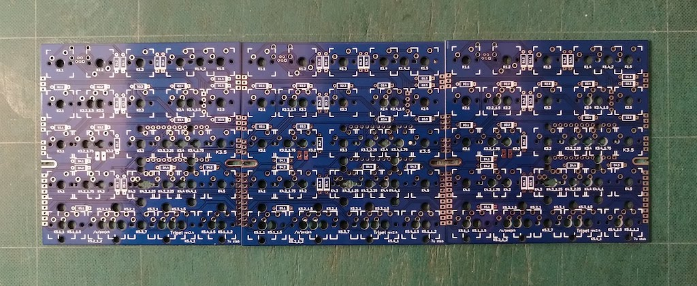
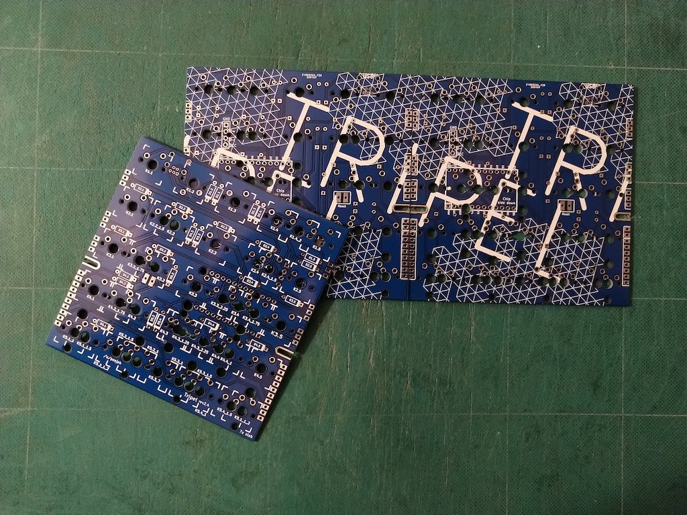

# Tripel - 60% keyboard PCB

Tripel is a 15x4+1x5 key ortholinear keyboard PCB.

The goal of this project is to build a pro-micro powered ortholinear PCB that fits in a standard 60% tray mount case but built from sub-100x100mm PCB boards.

* Designed to be easy to build with minimal soldering experience.
* Built from 3 of the same PCB.
* 7u spacebar bottom row.

# Bill of Materials (BOM)

* 3 PCBs.
* A suitable 60% ortholinear keyboard plate (eg. XD75 plate).
* 65 MX compatible switches.
* 65 1n4148 diodes.
* Pro Micro controller (or compatible alternative).
* 7u PCB mount stabilizer.
* Through-hole USB mini or micro connector.
* USB cable for Pro Micro.

# Ordering PCBs

PCBs can be manufactuered by a variety of online PCB fabricators. You can use [PCBShopper](https://pcbshopper.com/) to search for the best price. Many manufacturers have special rates for prototype boards under 100x100mm in size.

The zip file in the gerber directory contains the gerber files your fabricator will need to make the PCB [tripel.zip](https://github.com/peej/tripel-keyboard/blob/master/gerber/tripel.zip) PCB.

When uploading the gerber zip files, use the default PCB settings.

# Construction

* You will need 3 PCBs.
  * Cut off the USB stickout from the center and right PCBs with a hacksaw.
* Solder the diodes onto each PCB.
  * You can place them on either side, but the drawing on the soldermask is on the front of the PCB.
  * The end of the diode with black band goes in the square hole.
* Solder on the Pro Micro headers onto the underside of the middle PCB.
  * Do not solder on the Pro Micro yet.
  * To get keep the headers straight while soldering, place the Pro Micro over the headers to hold them in place.
  * If you want to use a socket for your Pro Micro, solder on a socket instead.
* Solder on the USB connector to the underside of the left PCB.
* Insert the switches into the plate.
  * If using a XD75 ortholinear plate, you will need to modify it if you are using the 1.5u bottom row layout.
* Join the PCBs together by solder the solder bridges between the PCBs.
  * Solder the top right 3 pad bridge to the right PCB as indicated by the soldermask.
  * Solder the middle left 3 pad bridge to the left PCB as indicated by the soldermask.
  * Solder both 8 pad bridges.
  * Use small bent pieces of trimmed diode wire to bridge the solder bridges instead of just using solder.
* Put the stabilizer together and fit it into the left and right PCBs.
  * If you forget the stabilizer you will need to unsolder all of the switches so as to fit it.
  * Don't forget to trim and lube your stabilizer before fitting if you want to.
* Place the PCBs onto the switches:
  * Insert all the switches and ensure that the pins of each switch are correctly coming through the board and are not bent under the PCB.
* Solder all the switch pins.
  * Some switches might foul on your case mounting posts stopping the PCB from sitting flush, before soldering, trim the switch pins which would foul so they are flush with the PCB.
  * The switch next to the Pro Micro might need to have it's pins trimmed so that your USB cable can plug in and sit as flush as possible to the PCB.
* Solder on the Pro Micro:
  * Ensure that you have it the correct way around, the chip side should be face down towards the PCB with the USB port to the right.
  * You might want to plug in your USB cable while soldering so that the Pro Micro is mounted far enough from the PCB for the cable to plug in successfully.
  * Use electrical tape underneath the Pro Micro if you think shorting against the switch pins could be an issue.
* Cut your USB cable to length and solder the wires to the pins for the USB connector.

# Firmware

Build and flash the Pro Micro with QMK firmware, see the [QMK documentation](http://qmk.fm/) on how to do this.

The required pinout for the firmware is shown in the following image:

A preconfigured firmware is not yet available in the QMK repo.
